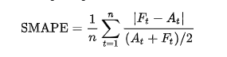
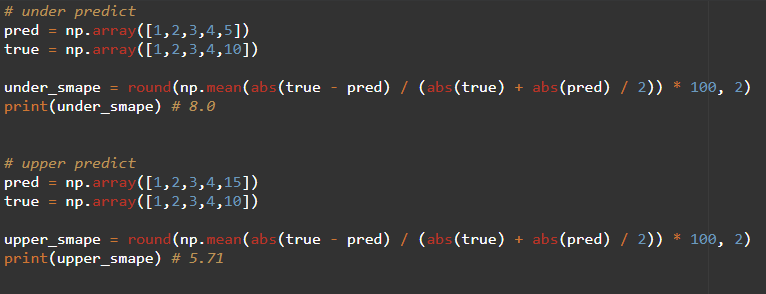

## KAGGLE INK DETECTION COMPETITION

- tabluer data set
- result : 38 / 1805 Silver Medal
- [Competition link](https://www.kaggle.com/competitions/amp-parkinsons-disease-progression-prediction)
- [PPT resource](https://www.canva.com/design/DAFuH-G0luY/0uULVOyHxi_T5gYnrdQQOg/edit?utm_content=DAFuH-G0luY&utm_campaign=designshare&utm_medium=link2&utm_source=sharebutton)

 

----

 

# 대회 설명

- [목적] 파킨슨 환자들의 단백질, 펩타이드 정보를 활용하여 미래시점에 UPDRS SCORE(환자들의 일상생활 비운동성, 운동성 지표)를 예측하는 대회

 

### DATASET

- dataset info
  - train: 248명의 환자의 방문월마다의 단백질, 펩타이드 정보 
  - 각 환자는 0 ~ 108 month(간격이 존재)의 데이터가 존재함, 그러나 모두 같은 월이 존재하지 않음, 누군가는 0,3,6만 누군가는 0, 3, 6, 12, 18 ... 까지 데이터존재
  - 각 환자들의 단백질 펩타이드 정보가 완벽하지 않음. a환자에게는 발견된 단백질이 b환자에게는 발견되지 않을 수 있음
  - 중요한 feature인 약의 섭취여부는 train set에만 존재, test set에는 이 feature가 없음
  - 227개의 단백질, 968개의 펩타이드 존재
- supplemental set도 존재
  - train set과 다른 분포를 가지고 있음 
  

  - label : 각 달의 updrs_1,updrs_2,updrs_3,updrs_4 score, lable에도 nan값 존재

 

-----

 

### 사전조사

- 여러 논문들을 통해 알아낸 지식

1. 하나의 단백질에는 여러 펩타이드가 존재
2. 특정 단백질과 펩타이드가 파킨슨병과 연관이 있음
3. 단백질이 펩타이드보다 타깃변수에 영향을 줄 수 있음
4. 파킨슨질병과 연관된 질병이 있고, 이 질병 또한 특정 단백질과 펩타이드에 영향을 받을 수 있음

- 크게 특정 단백질과 펩타이드를 선택하고, 이와 target 변수간의 상관관계를 찾아 학습을 진행하자.
- 또한 펩타이드나 단백질 구조정보에서도 상관성이 있는지 파악해보자.

 

## Training Plan

## 문제정의

[문제] 1. 환자의 정보가 모두 다름. (방문월, 단백질, 펩타이드 정보) 안정적으로 학습할 방법은?
[문제] 2. 여러 외부 데이터를 활용하여 파킨슨병과 관련된 단백질, 펩타이드 정보를 취합하여 이들 중 데이터셋에 있는 것들을 찾았지만 연관성이 나오지 않음. 다른 단백질과 펩타이드의 연관성은?
[문제] 3. label에서 nan값이 존재, 이를 없애면 데이터의 수가 작아짐, 대체할 방법은?
[문제] 4. 분포가 다른 supplemental data set을 활용할지?
[문제] 5. 약 섭취유무라는 매우 연관성이 깊은 FEATURE가 train set에만 존재, 이를 활용할 수 있는 방법은?

 

- EDA

- 각 환자들의 updrs별로 graph를 그려봄
  - 방문시간이 지날수록 score가 우상향하는 것을 알 수 있음
  - 치료를 받고 나아지는 환자분들도 있겠지만 결국 시간이 지날수록 조금씩 점수가 높아짐
  - 약을 섭취한 사람들은 약을 섭취하지 않은 사람들보다 확실하게 천천히 점수가 올라가거나 유지
  - 지그재그현상이 6 or 12간격으로 존재
  
 

- supplemental data set과 train set의 분포를 graph로 그려봄
  - 비슷한 분포를 가지는 updrs1, 4 다른 분포를 지닌 updrs 2, 3을 확인
  - 2, 3은 train set에서 0이 많이 발견되어 그 부분의 값의 차이가 매우 다름

 

- medicine을 사용유무에 따라 updrs graph를 그려봄
  - medicine을 사용한 그룹과 아닌 그룹의 양상이 다름
  - 상관관계도 높게 나옴

 

- 단백질, 펩타이드와 각 target값과의 corr를 살펴봄
  - 높은 corr를 가진 단백질과 펩타이드 후보를 10-20개 선택
  - 이 중 모든 환자 모든 시점에서 가장 많이 나오는 단백질과 펩타이드 2-5개 선택

 

- alpha_synuclein, alzheimer, beta_amyloid_antibody, beta_amyloid_peptide_fragment, tau, tumor_necrosis_factor 등 파킨슨과 연관된 단백질과 펩타이드 선별
  - 데이터 셋에서 해당 단백질과 펩타이드를 찾았으나 거의 나타나지 않음
  - 또한 찾은 단백질이나 펩타이드가 특정 환자(적은 수)에서만 나타나거나 거의 모든 환자에게서 나타나지 않음
  - 또한 위와 연관된 단백질과 펩타이드 종류 자체가 데이터셋 환자에게서 발현하지 않음

 

- 결측치 처리
  - 각 시점, 각 target에 따라 그 시점의 median, mean 등으로 대체 실험
  

-----

 

## 평가지표 - SMAPE

- SMAPE : Symmetric mean absolute percentage error
- ※ SMAPE 지표는 예측값이 실제값보다 under일 때 upper 일 때보다 더 오차가 커짐

 

---

 

## MODEL

- random forest, linear regressor, ridge, lightgbm, xgboost 등 test
- 이 중 lgbm과 linear regressor가 후보로 선택 (빠른 학습 및 성능) (기간과 어느정도 선형적인 관계가 있기 때문이지 않을까?)
- scipy optimize, minimize function
  
 

---

 

## Valid

- 환자 id에 따라 GroupKFold를 진행
- 각 target에 대하여 각각 모델을 학습
- 각 0, 6, 12, 24 기간에 대하여 학습
- 총 16개의 모델 * emsemble에 사용할 모델
- 예측을 시드값을 조절하면서 또는 n_splits 값을 조절하면서 100-200번 실험(분포를 파악하기 위해)
  - 그 결과 다른 사람들이 한 결과보다 분포가 좁게, score 자체도 좀 더 낮게 나옴
  - 
 

---

 

## Result

- 2개의 submit을 제출해야 했고, 가장 높은 cv를 달성한 sample과 가장 높은 lb를 달성한 sample을 선택하여 최종 제출, 결과 public 32 place -> private 38 place (어느 정도 일반화가 되었다고 생각, 보편적인 단백질을 선택하여 학습을 진행했기 때문이지 않을까)
- 이 대회에서는 꽤 큰 shakeup(lb에서는 낮은 점수를 기록했지만 최종 private leaderboard에서는 높은 성적으로 기록)이 발생함, 그 이유는 검증의 방식, 오버피팅, 잘못된 단백질을 선택 등 다양한 이유가 존재

 

---

## Review

**0. 완성도가 떨어지는 데이터셋을 어떻게 핸들링할 것인가?**
- 기본적으로 대회 데이터는 어느 정도 깔끔한 형태를 지니고 있음(일관성, 결측치, 활용성 등)
- 이 대회에서 중요한 특징인 약 사용유무는 train set에서만 존재하는 값이고 이걸 활용할 방법을 고민했지만 성과를 얻지 못함
- 또한 각 환자나 시점에 대하여 일관성이 없는 데이터, 그러나 여기서 어떤 관점에서 환자의 데이터를 바라보고 전처리하는가가 이 대회의 가장 큰 핵심이었음
- 결국 완성도가 떨어지는 데이터셋이라도 그 안에서 무엇을 발견할 수 있는가가 중요하고 만약 도메인 지식을 통해 완성도를 끌어올릴 수 있다면 그것도 좋은 경험이라고 생각함 

 

**1. 익숙하지 않은 도메인일 때 어떻게 지식을 쌓고 이를 검증하는지 경험**
- 논문들과 참고문헌들을 활용하여 분석할 때 최소한의 가이드라인을 지키며 데이터를 핸들링할 수 있음
막상 논문들에서 상관성이 있는 단백질과 펩타이드가 없는 경우가 많아서 상관성이 있는 후보군들을 하나씩 찾아보며 연관성을 탐색

 

**2. 사용해보지 않은 optimize 함수를 사용한 경험**
- 디스커션이나 코드공유에 올라오는 좋은 정보나 실험들을 활용하는데 이번 대회에서 scipy의 optimize를  사용한 방법이 획기적인 성능을 보임
- optimize는 고차원함수의 minimum값을 찾을 때 활용하는데 이번 대회에서는 시간이 지날 수록 score가 우상향하는 것을 보고 이전 달과 다음달의 트랜드 값을 곱하여 다음 달을 예측하는 방법으로 사용

 

**3. 결국 데이터에서 어떤 인사이트를 찾는지가 가장 중요했던 경험**
- 상위 18위 정도가 건강한 환자와 건강하지 않은 환자를 나누어 학습을 진행했을 때 가장 높은 점수를 받을 수 있었음 (타겟 그래프가 월기준 지그재그였던 이유, 건강한 사람들은 12개월이나 24개월 단위로 병원을 찾고, 아픈 사람들은 그것보다 짧은 6개월 단위로 병원에 방문했을 수 있다는 가능성)
- 데이터에서 어떤 관점으로 여러 실험들을 하는지가 매우 중요하다고 생각함
- 의심의 근거를 찾고, 그 근거를 바탕으로 도메인 지식안에서 여러 실험을 통해 좋은 인사이트와 성능을 올릴 방법을 찾아보는 것이 핵심
